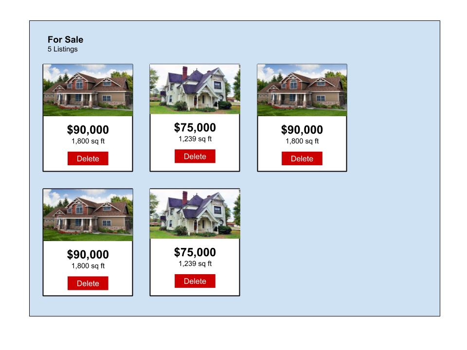

# Weekend Challenge 4 - Angular, Node, Express & SQL

Welcome to weekend challenge 4! This weekend, you will take on the role of an application developer for a real estate company. You will be working with data that we will be providing to you. After importing the data (instructions below), you will find information for properties that are either for "rent" or for "sale".

You job is to get this data onto the DOM. Use client side routing (`angular-route`) to display the rentals on one view and listings for purchase on another view. There should be two navigation links on the page allowing the user to switch between the two views.

> NOTE: Deploying to Heroku is **not** required for this assignment. We will cover deployment with SQL next week.

## Project Requirements

- [ ] Create a Full Stack application from the ground up using Angular, Node, Express, and SQL (SEAN stack).
- [ ] Work with the data set provided to you.
- [ ] Account for the different data properties ("rent" versus "sale") and ensure that they only show up on the correct views.
- [ ] 3 views, 3 angular routes, each with a controller and view file. See view/route details below.
- [ ] Implement a `Card`, a common user interface element.
 

## Importing the Provided Data File

Create a database called `real-estate`. You will need import the `listings.sql` file into your database. In order to do this, you will need to create a `listings` table with a `CREATE TABLE "listings"` command. Look at the `INSERT` statements to determine which columns should be added to this table. Be sure to add your `CREATE TABLE` query to the `database.sql` file so that we can see how you did it.

## Views and Layout

Here is a mockup of a card-based layout for real estate listings. This is a guide for the Rental and Sale views below. Feel free to improvise.

### Home/Add Listing View/Route

- [ ] Create a client-side route, controller, and view file for the home page.
- [ ] Allow a user to add a property to the database on this view. You will need to give the user an option for either a Rental property or a Sale property.
- [ ] Allow the user to enter the name of one of the images provided to display with the new listing. This only needs to be a text input.

### Rental Property View/Route

- [ ] Create a client-side route, controller, and view file for Rental properties.
- [ ] Display only those properties that are For Rent.
- [ ] Display the listings in "card" elements, including the associated image. Images have been provided for you and assigned to each property.

### Sale Property View/Route

- [ ] Create a client-side route, controller, and view file for Sale properties.
- [ ] Display only those properties that are For Sale.
- [ ] Display the listings in "card" elements, including the associated image. Images have been provided for you and assigned to each property.

## Dealing The Cards

The `Card` interface component is very common across the webs. Bootstrap 4 includes a card element, as do most popular CSS frameworks like Angular Material and React's UI Material. They are in your future!

Otherwise, creating one with your own CSS isn't so bad. W3 even has a page on it: [https://www.w3schools.com/howto/howto_css_cards.asp](https://www.w3schools.com/howto/howto_css_cards.asp)

## Tips

Don't get too hung up on the card and layout. Getting the data on the page is more important. Without the data, the application is useless. Spend your time wisely!

## Stretch Goals

- [ ] Ability to delete an existing listing. Place the `delete` button on each listing card.
- [ ] Move all `$http` requests to an Angular Service

## More Stretch Goals

- [ ] Display the least expensive property featured prominently at the top of the view
- [ ] Ability to search or filter by various parameters (try doing this using a server side route with a query parameter)
- [ ] Add other images to your application
